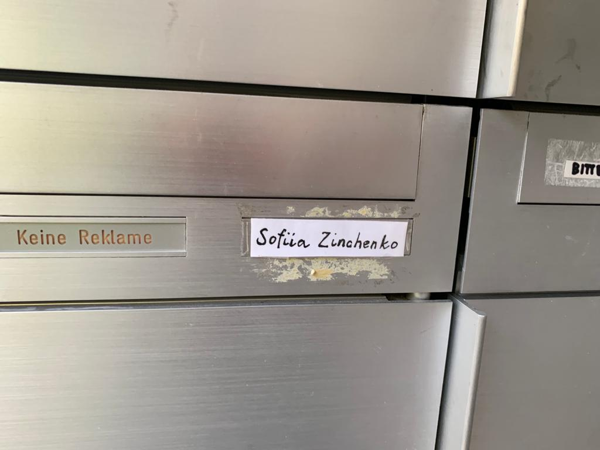
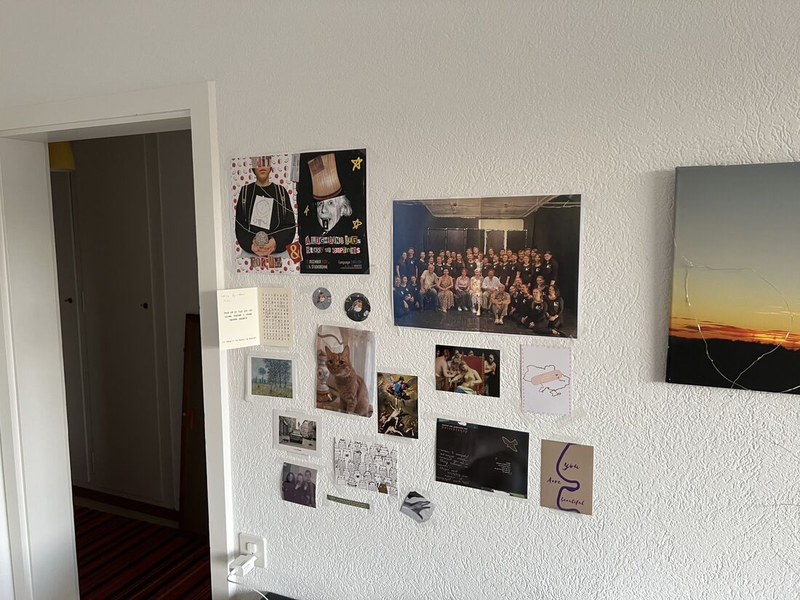

+++
title = "«Auch im Krieg braucht es Humor» "
date = "2023-05-08"
draft = false
pinned = false
image = "img_0051_3-2-.jpg"
+++


Der Ukrainekrieg hat tausende von Ukrainer-/innen in die Flucht getrieben. Sofiia Zinchenko hat in der Schweiz Unterschlupf gefunden - bei der obersten Verantwortlichen für Migration.



*Eine Reportage von Samuel Bossart*

Ein kurzes Zögern, ist es wirklich die richtige Türe? An der Klingel steht nämlich «Sabine Handschin» und nicht «Sofiia Zinchenko». Ist es tatsächlich die Wohnung, in die meine Familie einen Grittibänz oder ein selbstgebackenes Brot gebracht hat? Die Türe geht nach nur wenigen Sekunden auf. Eine lachende Sofiia heisst mich willkommen. Sofiia gestikuliert - komm herein. Der kurze Gang ist kahl, entlang der weissen Wände stehen auf schwarzem Linoleum ein paar Winterschuhe. . 

Wir gehen durch einen kleinen, engen Eingangsbereich. Geradeaus die Toilette, rechts liegt der Raum, der gleichzeitig als Ess-, Wohn- und Schlafzimmer dient. Sie bietet auf Englisch Tee und Kaffee an. Als sie in der Küche verschwindet, um Tee zu machen, setze ich mich auf das L-Förmige Sofa in der Ecke des vielleicht 30 Quadrat-Meter kleinen Zimmers. An der einen Wand, vis-à-vis vom Bett, hängen mehrere kleine Karten und Bilder. Neben diesem Raum und einer Toilette gibt es auch noch eine Mini-Küche, mit Sicht auf die Berge und das Münster, aus der Sofiia mit einer Tasse in der Hand kommt und sich auf den anderen Abschnitt des Sofas setzt. Ich übergebe ihr ein kleines Geschenk - vier verschiedene Berner Mandelbärli – schliesslich will ich ein guter Gast sein, der etwas Lokales mitbringt. Sie schaut sich die drei Bärchen an, lacht und sagt: «Ich habe noch nie eines gegessen, aber schon oft gehört, dass sie sehr gut seien. Danke vielmals!». 



Am 24. Februar 2022 greift die russische Armee die Ukraine an. Die «Militäroperation» in der Ukraine, so die russische Bezeichnung für den Angriffskrieg, beginnt im Osten der Ukraine, an der russischen Grenze. Der russische Präsident nennt vier Gründe. Erstens: Die Ukraine sei kein legitimer Staat. Es gäbe keine Ukraine, ohne Russland. Zweitens sollen Nazis an der Macht sein, welche vom Westen dort installiert  worden seien. Er wolle mit dem Einmarsch den Staat «entnazifizieren». Drittens bedrohe die Ukraine Russland militärisch, da sie in die NATO aufgenommen werden wolle. Russland müsse dies verhindern. Zuletzt behauptet Putin, die Ukraine habe gefährliche Bio-Labore, welche Waffen herstellen, um Russland anzugreifen. Die zweitgrösste Stadt der Ukraine mit 1.4 Millionen Einwohner-/innen ist  Charkiw. Es ist die Heimatstadt von Sofiia und liegt im Osten, ungefähr 50 Kilometer von der russischen Grenze entfernt. 



**Mit Freundinnen geflohen**

Sofiia Zinchenko ist seit März 2022 in der Schweiz. Sie ist gerade nach Kriegsausbruch mit einem Rucksack und einer Tasche aus Charkiw geflohen. «Seit Februar 2022 habe ich mehr Interviews gegeben als je zuvor in meinem Leben. Also - ich bin jetzt richtig gewöhnt», sagt sie lachend. Das Handy liegt auf dem kleinen Tisch bereit, um unser Gespräch aufzunehmen. Sie erzählt, sie fühle sich hier gleichzeitig freier, aber auch eingeschränkter. Sie könne so laut telefonieren, wie sie wolle, es versteht sie niemand und niemand wisse, wer sie sei. Gleichzeitig sei sie aber auch stark absorbiert, da zuhause immer noch Krieg herrsche: «Wir kamen an, und haben sogleich begonnen, die Uni in Bern zu besuchen. Im März startetet dann auch die ukrainische Universität wieder – online:  «Das half mir sehr». Sie sei zum Glück nicht allein da, Masha und Polina, zwei Mitstudentinnen Sofiias sind ebenfalls in die Schweiz geflohen. Das habe ihr sehr geholfen. Zu Beginn seien sie alle drei so gestresst gewesen, dass sie nur noch Gebäcke gegessen haben und dick wurden. «Einmal in der Woche hatte eine von uns Dreien einen Nervenzusammenbruch. Man wusste nie, wen es trifft, und es passiert auch jetzt immer noch ab und zu». 

Der Umgang mit dem Krieg und den Nachrichten aus der Ukraine hier in der Schweiz, dem sicheren Land, ist für die 22-jährige Schauspielstudentin nicht einfach, und sie erzählt, wie sie versuche, loszulassen, nicht immer wieder daran zu denken, was mit den Eltern los ist, die einen Bauernhof besitzen in der Nähe der russischen Grenze. Die Eltern wollen ihre Tiere nicht verlassen und sind darum trotz Krieg auf ihrem Hof geblieben. 

Sofiia zeigt auf ihrem Handy Videos vom 25. Februar, dem Tag nach dem Angriff der russischen Armee auf die Ukraine. Auf dem Film ist sie mit ihren zwei Kolleginnen zusehen, die nun auch in der Schweiz sind, und Sofiia spielt im Garten Ukulele. «Auch im Krieg braucht es Humor» sagt die 22-Jährige aus Charkiw, die zuerst ein Medizinstudium anfing, dann aber zu Schauspiel wechselte.  «Dass ich über Krieg Witze mache hat andere zum Teil recht gestört.» Einmal hätte sich ihre Familie in der Nacht in den Keller begeben müssen, und sie habe damals gewitzelt:  «Ich will doch wenigstens einfach in meinem Bett sterben». 

Plötzlich vergräbt sie ihr Gesicht in den Händen. Einen kurzen Moment verliert sie die Fassung. Doch auch das nimmt sie mit Humor und schaut mich kurz darauf wieder lachend an. 

Krieg und Humor? Dies ist für mich überraschend, ich hatte immer ein Bild von Leuten, welche, sobald ein Krieg ausbricht, mehr oder weniger einfach in eine Depression fallen. Alle verstecken sich ständig in ihren Kellern und zittern vor Angst. So ein Bild hatte ich. Sofiia zeigt, dass dies so nicht stimmt. Wie wusste sie, wann Humor nicht mehr angesagt ist und sie tatsächlich in den Keller musste. Sie überlegt einen Moment und sagt dann: «Sobald Explosionen rund um unser Haus begannen». 

**Ironie des Schicksals** 

Sofiia zog im März 2022 neben uns in eine kleine Einzimmerwohnung ein. Die Wohnung war gerade frei geworden. Zuvor verteilte ein Kollege von Sofiia im Quartier Flugblätter, um eine Bleibe für Sofiia zu suchen. Wegen diesem Zettel im Briefkasten von Christine Schraner Burgener begann eine ungewöhnliche Begegnung. 

Christine Schraner Burgener ist nicht nur Besitzerin einer Einzimmerwohnung, sondern auch Staatssekretärin für Migration, die oberste Flüchtlingsverantwortliche des Bundes also. Sie wohnt im Nachbarhaus und wollte die kleine Wohnung eigentlich für ihre Mutter nutzen. Jetzt wohnt die junge Schauspielschülerin Sofiia aus der Ukraine darin. 

**Bern ist ihre Heimat**

Christine Schraner Burgener weiss, was es heisst, in einem anderen Land zu leben. Als Tochter eines Swissair Ingenieurs wuchs sie in Tokio auf. Später führte sie ihr Beruf ins Ausland, als sie von 2009 bis 2018 als Schweizer Diplomatin unterwegs war: Dublin, Bangkok und später Berlin. Sie erzählt, dass sie darum viele «Heimaten» hatte in ihrem Leben. «Ich fühle mich eigentlich als Weltbürgerin». Ihre Wohnung reflektiert dies ganz klar. Eine sehr diverse Mischung an Gegenständen, welche in der ganzen Wohnung gelungen verteilt sind: Vasen aus Burma, ein grosser Holz-Buddha aus Thailand, Fotografien mit politischen Würdenträgern wie Aung San Suu Kyi und weitere Erinnerungsstücke prägen ihren Living Room. 

Am Esstisch erzählt sie, was für sie ein Zuhause ausmacht. Für sie seien vor allem die sozialen Kontakte ausschlaggebend. Das bedeutet ihr Geborgenheit und Heimat. Sie habe diese Kontakte von Tokio bis nach Berlin knüpfen können – und natürlich in Bern, der Wahlheimat der Zürcherin. Ob sie nun für immer in Bern bleiben werde? Christine zögert keine Sekunde und sagt, dass sie es sich vorstellen könne, wieder ins Ausland zu ziehen. Ihre Wohnung in der Nähe der Aare aber will sie aber nie mehr aufgeben. «Ich gehöre hierhin», sagt sie bestimmt.

**«Nicht Putin bestimmt»**

Diesen Satz würde Sofiia, die ukrainische Schauspielschülerin, so nicht äussern. «Sehr oft fühle ich mich halt durchaus noch so, als würde ich nicht hierhin gehören», sagt sie, «auch wenn die Menschen freundlich sind.» Sie habe noch nie so freundliche Leute getroffen wie in der Schweiz. «Vor allem auch meine Nachbarn», witzelt sie mit einem breiten Lachen. 

Doch die sozialen Kontakte, die Sofiia bisher in der Schweiz gefunden hat, können ihr Heimweh nach der Ukraine und nach Charkiw, ihrer Heimatstadt nahe der russischen Grenze, nicht stoppen: «Ich gehe im Juni wieder zurück, wenn mein Semester beendet ist», sagt sie unvermittelt. Sie lasse sich nicht von einem Tyrannen wie Putin vorschreiben, wo ihr Wohnort sei, erklärt sie mit fester Stimme.  

Christine hat Sofiia das bereits mitgeteilt. Die Diplomatin hat versucht, die junge Studentin umzustimmen. Sie habe alles gegeben, um sie zu überzeugen, hier zu bleiben bis der Krieg beendet sei. Bisher vergeblich. Nun hofft Christine auf einen Meinungswechsel. Wie Sofiias Geschichte tatsächlich ausgehen wird, ist unklar. Der Kalender zeigt anfangs Mai.